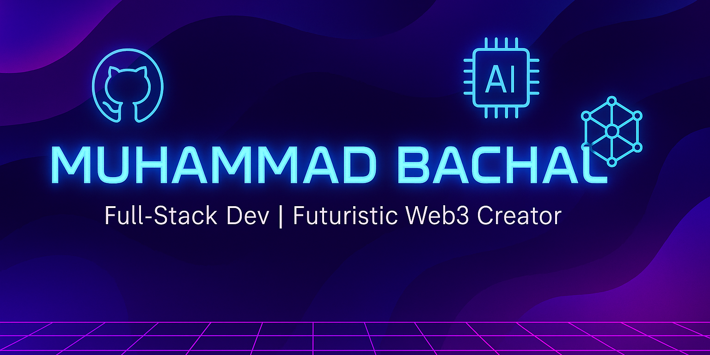

<!-- Futuristic Space Header -->

<h1 align="center">🌌 Muhammad Bachal — Navigating the Dev Universe 🚀</h1>

  <i>Exploring the frontiers of Web3, AI, and the digital cosmos one project at a time.</i>

### 🧑‍🚀 About Me

- 👽 I'm Muhammad Bachal, a Data Science undergrad and self-taught developer on a mission to reshape the web.
- 🧠 Passionate about building tools that solve real-world problems using AI & Blockchain.
- 🌍 Based on Earth, but mind’s orbiting in space.
- 🧩 Currently working on: `Digital Mirror - Procrastination Breaker`.

### 🛸 Tech Galaxy

#### 🚀 Languages & Tools

### 🛰️ Projects in Orbit

- 🔭 [**Nezumi**](https://github.com/bachal-abro/nezumi): A futuristic, decentralized video platform for creators of the new internet.
- 🧠 [**Digital Mirror**](https://github.com/bachal-abro/digital-mirror): A productivity booster that reflects your procrastination in real-time.
- ⚙️ [**Smart Contracts Toolkit**](https://github.com/bachal-abro): A boilerplate for EVM smart contracts with best practices.

### 📡 Activity Radar

  
   
  
   
  

### 🌐 Connect with Me

  
  
  

### 👾 Space Logs

> "In the world of code, I fly not just among syntax but among stars." – @bachal-abro

<!-- Stargazer Signature -->

  

